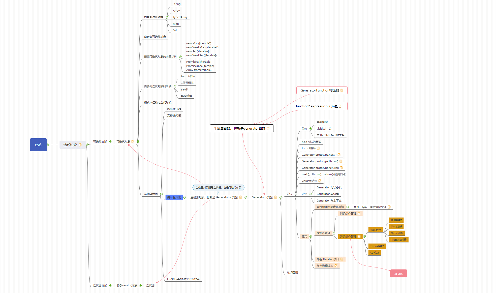

# generator函数与generator对象




## 背景

## 迭代协议

**迭代器协议** 与 **可迭代对象协议**

[MDN参考地址](https://developer.mozilla.org/zh-CN/docs/Web/JavaScript/Reference/Iteration_protocols#iterable)

## generator含义

[MDN参考地址](https://developer.mozilla.org/zh-CN/docs/Web/JavaScript/Reference/Global_Objects/Generator)

>1. 生成器对象是由一个 generator function 返回的,并且它符合可迭代协议和迭代器协议。
>2. 使用构造函数  GeneratorFunction 或 function* expression 定义生成器函数
>3. function* 这种声明方式(function关键字后跟一个星号）会定义一个生成器函数 (generator function)，它返回一个  Generator  对象
>4. generator函数运行，生成了Generator对象，Generator对象既是一个迭代器，又是一个可迭代对象。迭代器的核心是部署了next()方法，可迭代对象是符合迭代器协议的对象，可以被 **for...of**, **...**, **解构赋值**, **yield*** 进行遍历等操作。

**语法**

```js
function* gen() { 
  yield 1;
  yield 2;
  yield 3;
}

let g = gen(); 
// "Generator { }"
```

**方法**

Generator.prototype.next()

返回一个由 yield表达式生成的值。

Generator.prototype.return()

返回给定的值并结束生成器。

Generator.prototype.throw()

向生成器抛出一个错误。

**示例**

```js
// 一个无限迭代器
function* idMaker(){
    let index = 0;
    while(true)
        yield index++;
}

let gen = idMaker(); // "Generator { }"

console.log(gen.next().value); 
// 0
console.log(gen.next().value); 
// 1
console.log(gen.next().value); 
// 2
// ...
```

## generator 函数的错误处理机制

**throw命令**是全局的，与generator函数无关，函数外部的程序出错，不会影响函数内部的状态

**generator.prototype.throw()** 是generator函数运行后，生成的Generator对象实例具备的方法之一，也是generator函数**错误处理机制的核心**，其他的两个方法是 **generator.prototype.next()** **generator.prototype.return()**

## 应用

### 作为数据结构

简单的说，就是generator函数运行，生成的Generator对象，是一个迭代器，也是一个可迭代对象，类似于数组。原生提供了next(), throw(), return() 方法，来应对不同的操作，可以执行下一步，错误机制，以及结束运行。

### 异步流程的同步化表达

### 应用示例

```js
const fs = require('fs');

// 方法1：回调地狱法
// fs.readFile('./files/1.txt', 'utf-8', (err, data) => {
//   fs.readFile('./files/2.txt', 'utf-8', (err, data) => {
//     fs.readFile('./files/3.txt', 'utf-8', (err, data) => {
//       //...
//     })
//   })
// })

// 方法2：数组法
const arr = [
  cb => fs.readFile('./files/1.txt', 'utf-8', cb),
  cb => fs.readFile('./files/2.txt', 'utf-8', cb),
  cb => fs.readFile('./files/3.txt', 'utf-8', cb),
];

function run (arr) {
  function next(i = 0, preData) {
    if (i === arr.length) {
      // 这里异步操作全部结束，做点别的？
      // console.log(arr, JSON.stringify(arr))
      return;
    }
    const fn = arr[i];
    fn(function(err, data) {
      if (err) throw err;
      // arr[i] = data;
      console.log(preData, data);
      next(++i, data);
    });
  };
  next(0);
};

run(arr);

// console.log(JSON.stringify(function(){}))

// 方法3： generator函数法

function* gen() {
  yield cb => fs.readFile('./files/1.txt', 'utf-8', cb);
  yield cb => fs.readFile('./files/2.txt', 'utf-8', cb);
  yield cb => fs.readFile('./files/3.txt', 'utf-8', cb);
}

function runs(fn) {
  const g = fn();
  function next(err, data) {
    // 本例子，这里打印四次，第一次忽略
    console.log(err, data);
    const result = g.next();
    if (result.done) return;
    result.value(next);
  };
  next();
}

runs(gen);
```

## 总结

基本概念与示例，在mdn网站都有总结，讲的简洁明了，此处不做赘述。

generator的出现，使得 **Thunk函数** 思想焕发力量。

Thunk函数，在js中，就是将 js的多参数函数，通过回调函数的方法，转换成多个单参数函数。也就是高阶函数，或者说函数的柯里化。因为函数只有在运行时，才会对其中的表达式进行求值。

generator函数和Thunk函数思想结合，解决了js的异步问题，这个也是async...await的底层原理。
