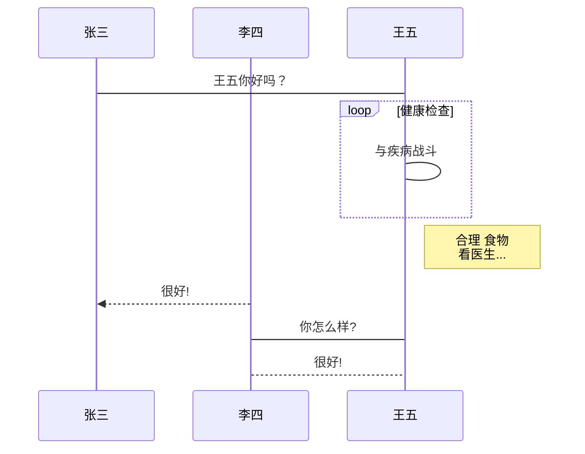

# 浏览器的工作原理 - 简单理解


```flow
st=>start: 开始框
op=>operation: 处理框
cond=>condition: 判断框(是或否?)
sub1=>subroutine: 子流程
io=>inputoutput: 输入输出框
e=>end: 结束框
st->op->cond
cond(yes)->io->e
cond(no)->sub1(right)->op
```

```sequence
对象A->对象B: 对象B你好吗?（请求）
Note right of 对象B: 对象B的描述
Note left of 对象A: 对象A的描述(提示)
对象B-->对象A: 我很好(响应)
对象A->对象B: 你真的好吗？
```



## 通讯

HTTP： 裸的 tcp 连接

HTTPS： 先建立 tls 加密通道，再走 tcp 连接

HTTP2

## DOM 树构建

字符流 --> 状态机 --> 词token --> 栈 --> DOM树

todos 完善该例子

字符流 或者 json 或者 其他媒体流 数据，用 js 动态生成 HTML 代码，构建成 DOM 树

## CSS 计算

## 排版

正常流

盒模型

绝对定位元素

浮动元素

Flex排版

Grid排版

表格排版

## 渲染，合成，绘制

渲染，得到内存中的位图。图形底层库：android的skia，windwos的gdi。文字：字体库（Freetype，一个C++编写的开源字体库）。

合成，可选的优化。合成策略，就是为了减少绘制次数。

绘制，显卡驱动的绘制策略。位图绘制到屏幕上，变成肉眼可见的图像的过程。浏览器交给操作系统，操作系统交给显卡驱动，让显卡来进行绘制。

重排：排版行为。

重绘：计算机图形学中，“脏矩形”算法，屏幕均匀分成若干矩形，合适的矩形大小，有效控制绘制时的消耗。过大，绘制面积增大（gpu吃力）；过小，计算过于复杂（cpu吃力）。重新绘制脏矩形区域即可，不用全部绘制。

## TODOS

todos 玩具浏览器实现。

todos 完善该例子 字符流 --> 状态机 --> 词token --> 栈 --> DOM树

todos Flex排版，Grid排版
