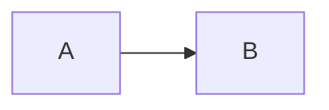

# web-api

## DOM

节点， 事件， Range， 遍历

### Node

关系属性， 操作方法， 高级api

节点必须使用 document 的 create 方法创建，不能使用 js 的 new 运算。于是，--
-- document对象方法

### Element 与 Attribute

### 查找元素

getElement 系列，获取到的是动态节点的集合

尽管 querySelector 强大，还是尽量使用 getElement 系列 API。

### 遍历

Js递归遍历， NodeIterator 和 TreeWalker

### Range

### 命名空间

### TODOS

打印整个DOM树的tagName

## CSSOM

todos 把一个网页的所有盒轮廓画到canvas上

## 事件

## Web API 归类

