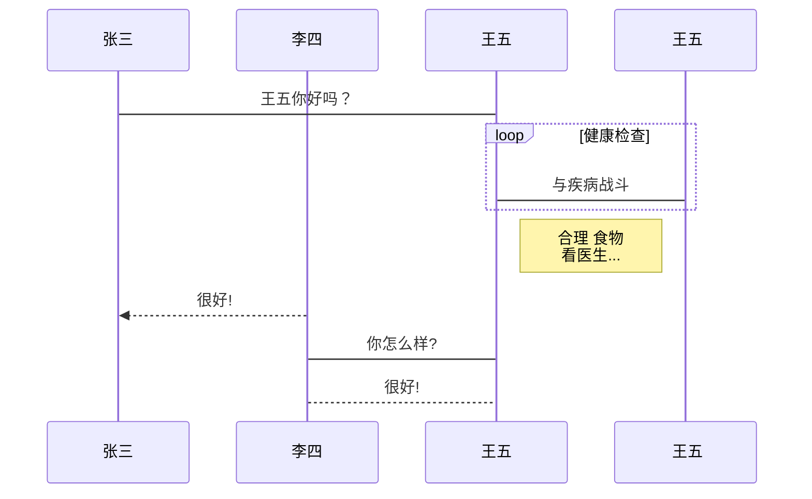

# Typora




```sequence
对象A->对象B: 对象B你好吗?（请求）
Note right of 对象B: 对象B的描述
Note left of 对象A: 对象A的描述(提示)
对象B-->对象A: 我很好(响应)
对象A->对象B: 你真的好吗？
```

```flow
st=>start: 开始框

op=>operation: 处理框

cond=>condition: 判断框(是或否?)

sub1=>subroutine: 子流程

io=>inputoutput: 输入输出框

e=>end: 结束框

st->op->cond

cond(yes)->io->e

cond(no)->sub1(right)->op
```

```less
.class {
    border: 1px solid red;
    margin: 0;
    .son {
        font-size: 16px;
    }
}
```

